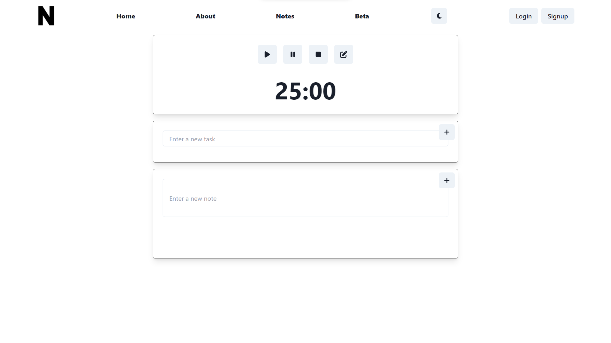
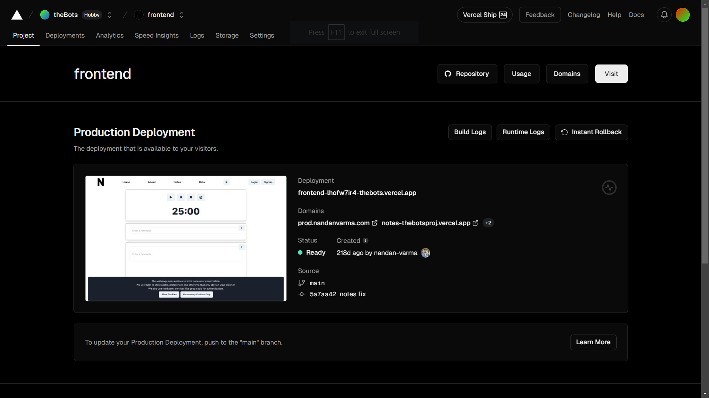
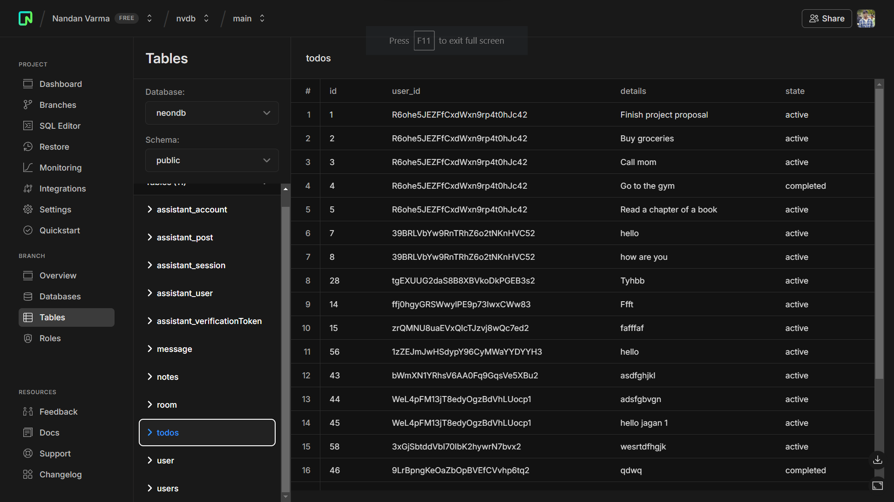
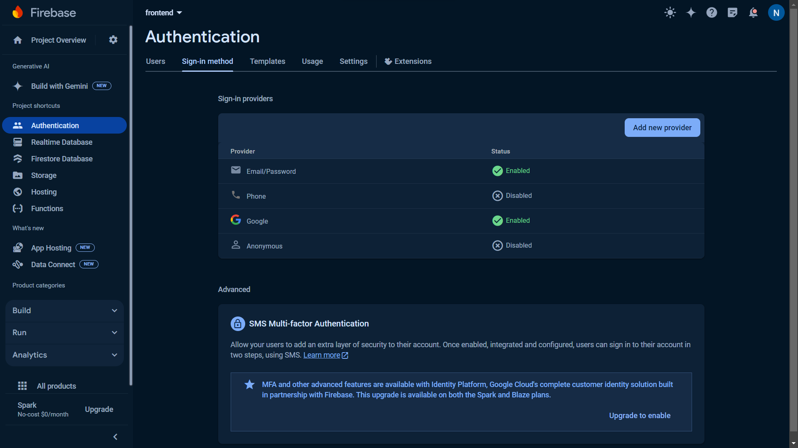
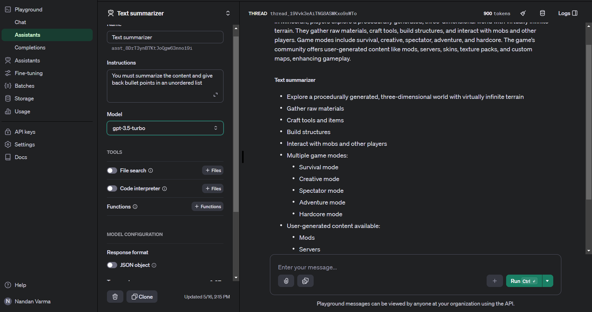

An application to gather thoughts and work on them

## Features

- Pomodoro Timer
- TODO list
- Notes
- Slick UI
- AI (of course its 2024 what do you expect)

## TODO
- Implement AI tools to common note taking scenarios like summarization and referencing

## Tools 
- [x] Pomodoro Timer
- [x] Notes
- [x] Todo  
- [x] save projects to DB (PostgreSQL)
- [x] Text summarization  
- [ ] Extension to hyperlinks (beta)
- [ ] Search, Content, YT video summarizer (alpha)

## Screenshots
### Website at https://prod.nandanvarma.com

### deployment and testing at https://vercel.app

### database at https://console.neon.tech

### authentication

### AI tools at https://platform.openai.com


## views
- home (/)
- about (/about)
- notes (/notes)
- beta (/beta)
- profile (/profile)
- notes with id (/auth_id/id) [ protected ]


## Getting Started

Install dependencies

```bash
pnpm install
```

First, run the development server:

```bash
pnpm dev
```

## What I learnt

- UI design
- Multi Platform support
- API design
- SQL Database with upgradability in mind
- AI assistants

extension built for this at https://github.com/TheBrosProj/extension


## Built with

- [Next.js](https://nextjs.org) for webpages and apis
- [chakra-ui](https://chakra-ui.com)
- Webpage and apis deployed on [Vercel](https://vercel.com)
- Postgresql Database Deployed on [neon.tech](https://neon.tech/)
- Authentication using [Google Firebase](https://console.firebase.google.com)
- AI assistants hosted at [OpenAI](https://openai.com)
